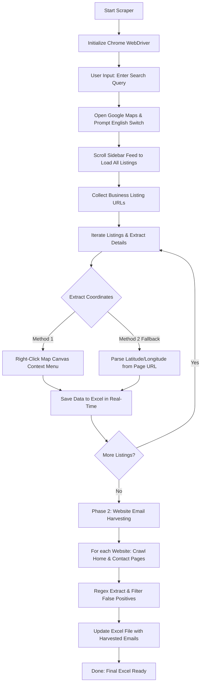

# 📍 Google Maps & Website Email Scraper

[](https://www.python.org/)
[](https://www.selenium.dev/)
[](https://pandas.pydata.org/)
[](LICENSE)

A powerful, robust, and interactive two-phase Selenium scraping automation tool. It extracts comprehensive business listings from Google Maps search results—including names, addresses, ratings, and precise geographic coordinates—and then automatically crawls their corresponding websites to harvest verified email addresses.

---

## 🌟 Key Features

* **⚡ Real-time Google Maps Extraction**: Automates the Chrome browser to search, scroll, and gather all business detail pages dynamically.
* **🎯 Precision Coordinates Retrieval**: 
  * *Primary Method*: Automates a right-click on the map canvas center to extract precise latitude and longitude from the context menu.
  * *Secondary Fallback*: Automatically parses coordinates from the browser URL using optimized regex matches.
* **🌐 Phase 2 Deep Email Harvesting**:
  * Crawls the business homepage and automatically discovers subpages using intelligent keyword matching (e.g., `contact`, `about`, `us`, `info`, `reach`).
  * Extracts emails using standard patterns and validates them to eliminate placeholders, assets, and third-party developer domain noise (e.g., Wix, Sentry, bootstrap, jquery, googleapis, `.png`, `.jpg`, `.pdf`).
* **💾 Real-time Excel Dump**: Saves scraped records continuously after each listing to `exported_data.xlsx`, ensuring zero data loss if the scraping session is interrupted.
* **🔧 Dynamic Web Driver Setup**: Utilizes `webdriver-manager` to automatically download and configure the compatible Chrome Driver version.

---

## 📐 How It Works (Workflow)



---

## 📦 Prerequisites & System Requirements

Before running the scraper, ensure you have the following:

1. **Python**: Version `3.8` or higher installed.
2. **Google Chrome**: Installed on your system.
3. **Internet Connection**: For search loading, Selenium automation, and website email scraping.

---

## 🚀 Installation & Setup

1. **Clone the Repository**:
   ```bash
   git clone https://github.com/pythonicshariful/Google-Maps-Scraper.git
   cd Google-Maps-Scraper
   ```

2. **Create a Virtual Environment** (Recommended):
   ```bash
   python -m venv venv
   
   # On Windows (Command Prompt)
   venv\Scripts\activate
   # On Windows (PowerShell)
   .\venv\Scripts\Activate.ps1
   # On macOS/Linux
   source venv/bin/activate
   ```

3. **Install Dependencies**:
   ```bash
   pip install -r requirements.txt
   ```

---

## 🎮 How to Run

1. **Execute the Script**:
   ```bash
   python main.py
   ```

2. **Enter your Search Query**:
   Input a highly specific search query in the prompt, for example:
   ```text
   Enter search query (e.g., 'Pharmacies in Mwanza, Tanzania'): Pharmacies in Mwanza, Tanzania
   ```

3. **Language Switch (Crucial Step)**:
   * Google Maps will open.
   * **Important**: Switch Google Maps' language to **English** in the settings sidebar if it is not already in English. This is necessary because element selection rules look for English UI attributes (such as `"Open website"` and `"Phone:"`).
   * Once switched, press **`Enter`** in the terminal to continue.

4. **Observe & Relax**:
   * The scraper will scroll the feed, collect the listings, visit each business page, extract information, right-click the canvas for coordinates, and save to `exported_data.xlsx` dynamically.
   * During **Phase 2**, the scraper will visit the retrieved websites, inspect the pages for contact information, extract emails, filter out noise, and append them directly to the Excel spreadsheet.

---

## 📊 Extracted Data Fields

The exported Excel file (`exported_data.xlsx`) includes the following structured columns:

| Column Name | Description | Example |
|---|---|---|
| **Business Name** | Name of the business | *Aga Khan Medical Centre* |
| **Address** | Physical location address | *Mwanza, Tanzania* |
| **Website** | Official business homepage link | *https://www.agakhanhospitals.org* |
| **Email** | Semicolon-separated verified emails scraped | *info@akdn.org; mwanza@akdn.org* |
| **Mobile Number** | Phone number | *+255 28 250 2412* |
| **Review Count** | Total number of reviews received | *184* |
| **Rating** | Overall rating score out of 5.0 | *4.2* |
| **latitude** | Geographic latitude coordinate | *-2.516482* |
| **longitude** | Geographic longitude coordinate | *32.902344* |
| **Map Link** | Direct Google Maps URL to listing page | *https://www.google.com/maps/place/...* |

---

## ⚙️ Customization Tips

Inside `main.py`, you can tweak variables to optimize performance based on your network speed:

* **Time Delays**: If you have a slower internet connection, increase the sleep timers to let pages load completely:
  ```python
  time.sleep(4)  # Increase inside loops or website crawl methods
  ```
* **Crawl Depth**: In `crawl_website_for_emails`, you can change the number of subpages checked:
  ```python
  subpages_to_visit = list(subpage_urls)[:4]  # Modify '4' to crawl more/fewer subpages
  ```
* **Email Filtering**: Exclude specific terms by modifying the list in `is_valid_email()`:
  ```python
  exclude_keywords = ['wix', 'example', 'sentry', ...]
  ```

---

## ⚠️ Disclaimer

This tool is designed for educational, personal research, and legitimate lead generation purposes. Scraping Google Maps might violate Google's Terms of Service. Use this script responsibly and avoid sending unsolicited spam emails. The developer is not responsible for any misuse, blockages, or liabilities resulting from this program.

---

## 📄 License

This project is licensed under the MIT License - see the [LICENSE](LICENSE) file for details.
